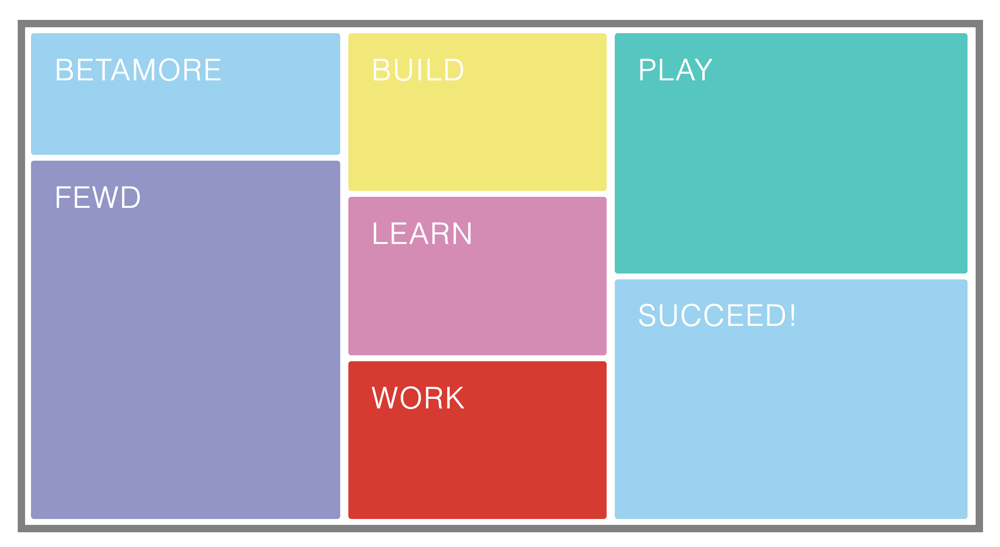

# Build a Betamore Bento Box - With Flexbox! Project

## Use CSS Flexbox properties and values to replicate this bento box design (feel free to choose your own colors!)

1. Start a new website project in a directory called Betamore-Bento-Flex, and create blank index.html and style.css files.

2. Write the HTML to create a container \
 with seven child \
 elements.** Inside each \
, put an \<h1> element consisting of the words Betamore, FEWD, Learn, Build, Work, Play, Succeed. Give the container an id of "bento"; give each child \
 BOTH a class name of "box" AND a class name of box1, box2, box3, etc.

3. Write the CSS necessary to style the initial appearance: 

- Give #bento a 10px solid darkgray border, a height of 75em and a width of 100em. Center the #bento container div on the page.

- Style the \<h1> elements so that the font color is white, font size is 3em, and margin is zero.

- Give each child box a different background color (your choice).

- All seven child boxes will need a set height and width. Figure out appropriate dimensions to fit them inside the bento container to match the design above.

4. Now, use Flexbox to (a) position the boxes inside #bento as in the provided design, and (b) to position the text in each box. This can be achieved using flex parent properties only -- including flex-direction, flex-wrap, justify-content and align-items -- though it's certainly ok to use flex child properties too, if you like.

### Keep in mind there are multiple ways to go about doing this, different combinations to create the same outcome. There is no one "right" way.

5. Create a new repository on GitHub and push your project from the command line. 

6. Post your repo's URL on Slack to "turn in" your assignment. Please share both the actual repository URL and the yourname.github.io url for viewing the final product in the browser.

