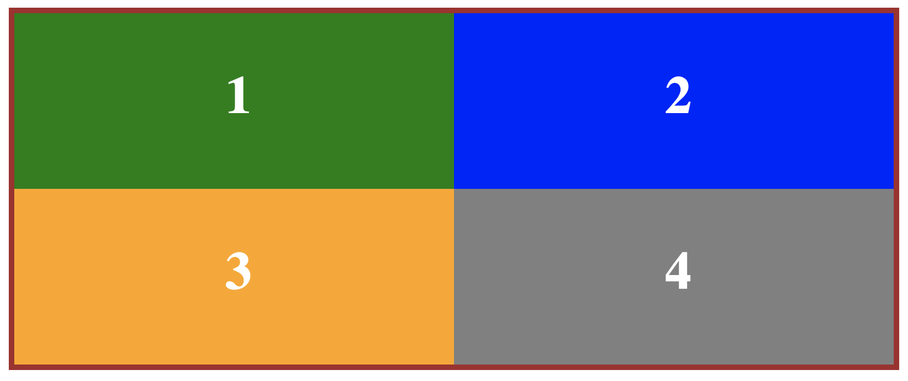

#CSS Positioning Homework

1. Start a new website project in a directory called CSS-positioning, and create blank index.html and style.css files.

2. Write the HTML to create a container 
 with four child 
 elements. Inside each 
, put a number from 1 to 4. Give the container an id of "bento"; give each child 
 a class name of box1, box2, box3, or box4. (So the div with class name "box1" should contain the number 1 inside, box2 has 2, etc).

3. Set up the look of the page by writing the CSS code necessary to:
  - Give #bento a 5px solid darkgray border and a width of 50em. Center the #bento container div on the page.

  - Give all four child boxes a height of 10em and a width of 25em. Set margin to 0 for each of them, too. 

  - Give each child box a different background color (your choice).
  
4. Now, use CSS positioning property with appropriate values (static, relative, absolute, fixed)to place the boxes inside #bento as follows:

  - Box1 should occupy the upper left quadrant of the parent container
  - Box2 should be in the upper right quadrant
  - Box3, lower left
  - Box4, lower right
  
  The final result should look like this: 
  
  
  Keep in mind there are multiple ways to go about doing this, different combinations to create the same outcome. There is no one "right" way.
  
  5. Create a new repository on GitHub and upload your project. 
  
  6. Post your repo's URL on Slack to "turn in" your assignment.
  
  7. Extra credit: try to do this assignment again, only this time using flexbox properties.
  
  

